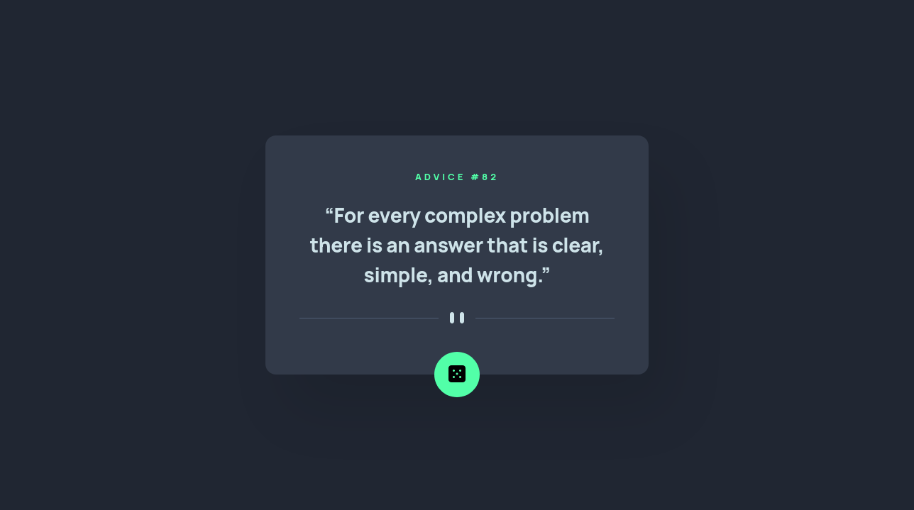

# Frontend Mentor - Advice generator app solution

This is a solution to the [Advice generator app challenge on Frontend Mentor](https://www.frontendmentor.io/challenges/advice-generator-app-QdUG-13db). Frontend Mentor challenges help you improve your coding skills by building realistic projects.

## Table of contents

- [The challenge](#the-challenge)
- [Links](#links)
- [Built with](#built-with)
- [Author](#author)

## The challenge

Users should be able to:

- View the optimal layout for the app depending on their device's screen size
- See hover states for all interactive elements on the page
- Generate a new piece of advice by clicking the dice icon

## Links

- [Solution URL](https://github.com/andreasremdt/fm-challenges/tree/main/advice-generator/)
- [Live Site URL](https://fm-challenges-ar.netlify.app/advice-generator/)

## Built with

- Semantic HTML5 markup
- CSS custom properties
- CSS Grid
- CSS animations and transitions
- Vanilla JavaScript with promises and the Fetch API

## Author

- Website - [andreasremdt.com](https://andreasremdt.com)
- Frontend Mentor - [@andreasremdt](https://www.frontendmentor.io/profile/andreasremdt)
