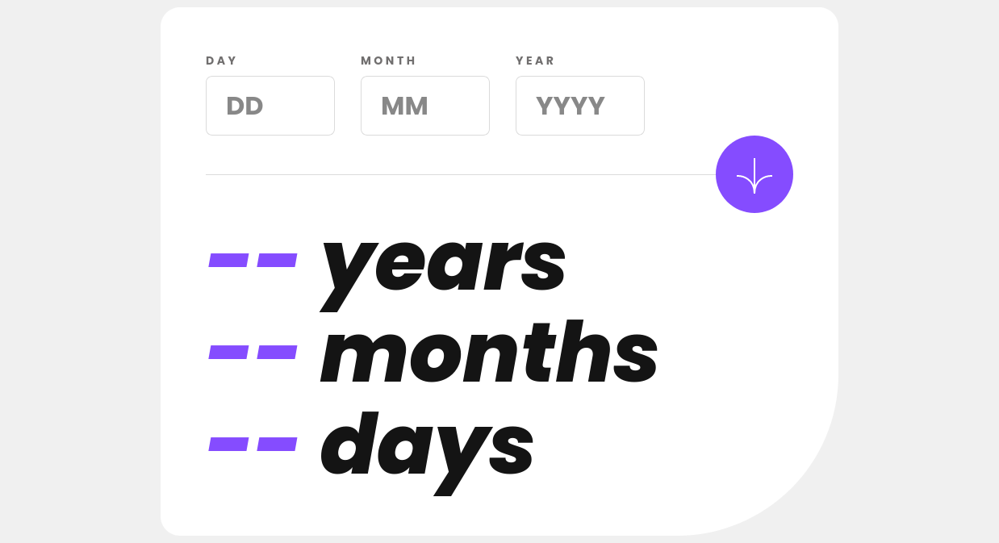

# Frontend Mentor - Age calculator app solution

This is a solution to the [Age calculator app challenge on Frontend Mentor](https://www.frontendmentor.io/challenges/age-calculator-app-dF9DFFpj-Q). Frontend Mentor challenges help you improve your coding skills by building realistic projects.

## Table of contents

- [The challenge](#the-challenge)
- [Links](#links)
- [Built with](#built-with)
- [Author](#author)

## The challenge

Users should be able to:

- View an age in years, months, and days after submitting a valid date through the form
- Receive validation errors if:
  - Any field is empty when the form is submitted
  - The day number is not between 1-31
  - The month number is not between 1-12
  - The year is in the future
  - The date is invalid e.g. 31/04/1991 (there are 30 days in April)
- View the optimal layout for the interface depending on their device's screen size
- See hover and focus states for all interactive elements on the page
- **Bonus**: See the age numbers animate to their final number when the form is submitted

## Links

- [Solution URL](https://github.com/andreasremdt/fm-challenges/tree/main/age-calculator-app/)
- [Live Site URL](https://fm-challenges-ar.netlify.app/age-calculator-app/dist/)

## Built with

- Semantic HTML5 markup
- CSS custom properties
- CSS nesting
- Flexbox
- TypeScript
- Vite

## Author

- Website - [andreasremdt.com](https://andreasremdt.com)
- Frontend Mentor - [@andreasremdt](https://www.frontendmentor.io/profile/andreasremdt)
