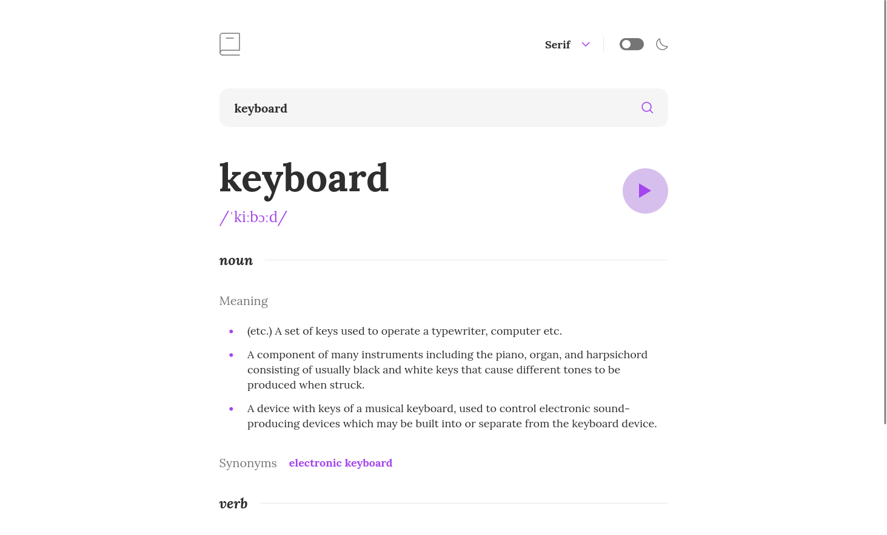

# Frontend Mentor - Dictionary web app solution

This is a solution to the [Dictionary web app challenge on Frontend Mentor](https://www.frontendmentor.io/challenges/dictionary-web-app-h5wwnyuKFL). Frontend Mentor challenges help you improve your coding skills by building realistic projects.

## Table of contents

- [The challenge](#the-challenge)
- [Links](#links)
- [Built with](#built-with)
- [Author](#author)

## The challenge

Users should be able to:

- Search for words using the input field
- See the Free Dictionary API's response for the searched word
- See a form validation message when trying to submit a blank form
- Play the audio file for a word when it's available
- Switch between serif, sans serif, and monospace fonts
- Switch between light and dark themes
- View the optimal layout for the interface depending on their device's screen size
- See hover and focus states for all interactive elements on the page
- **Bonus**: Have the correct color scheme chosen for them based on their computer preferences. _Hint_: Research `prefers-color-scheme` in CSS.

## Links

- [Solution URL](https://github.com/andreasremdt/fm-challenges/tree/main/dictionary-web-app/)
- [Live Site URL](https://fm-challenges-ar.netlify.app/dictionary-web-app/dist/)

## Built with

- Semantic HTML5 markup
- CSS custom properties
- Flexbox
- [SolidJS](https://www.solidjs.com/)
- [Vite](https://vitejs.dev/)
- [TypeScript](https://www.typescriptlang.org/)
- [ESLint](https://eslint.org/)

## Author

- Website - [andreasremdt.com](https://andreasremdt.com)
- Frontend Mentor - [@andreasremdt](https://www.frontendmentor.io/profile/andreasremdt)
