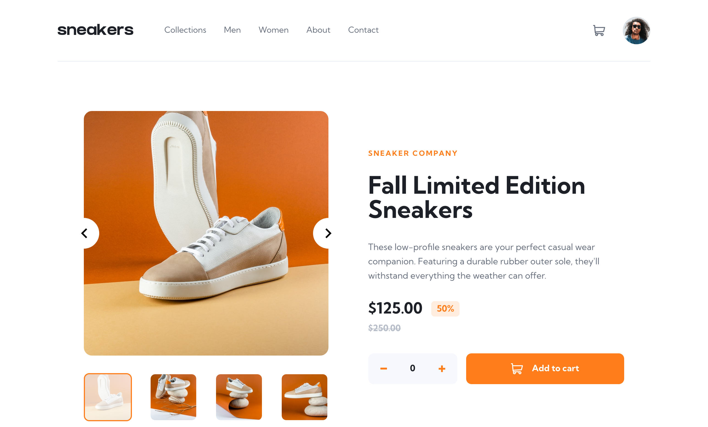

# Frontend Mentor - E-commerce product page solution

This is a solution to the [E-commerce product page challenge on Frontend Mentor](https://www.frontendmentor.io/challenges/ecommerce-product-page-UPsZ9MJp6). Frontend Mentor challenges help you improve your coding skills by building realistic projects.

## Table of contents

- [The challenge](#the-challenge)
- [Links](#links)
- [Built with](#built-with)
- [Author](#author)

## The challenge

Users should be able to:

- View the optimal layout for the site depending on their device's screen size
- See hover states for all interactive elements on the page
- Open a lightbox gallery by clicking on the large product image
- Switch the large product image by clicking on the small thumbnail images
- Add items to the cart
- View the cart and remove items from it

## Links

- [Solution URL](https://github.com/andreasremdt/fm-challenges/tree/main/ecommerce-product-page/)
- [Live Site URL](https://fm-challenges-ar.netlify.app/ecommerce-product-page/dist/)

## Built with

- [React](https://reactjs.org/)
- [TypeScript](https://typescriptlang.org/)
- [CSS Modules](https://github.com/css-modules/css-modules)
- [Headless UI](https://headlessui.com/)
- [Vite](https://vitejs.dev/)
- [Vitest](https://vitest.dev/)
- [React Testing Library](https://testing-library.com/)
- [ESLint](https://eslint.org/)

## Author

- Website - [andreasremdt.com](https://andreasremdt.com)
- Frontend Mentor - [@andreasremdt](https://www.frontendmentor.io/profile/andreasremdt)
