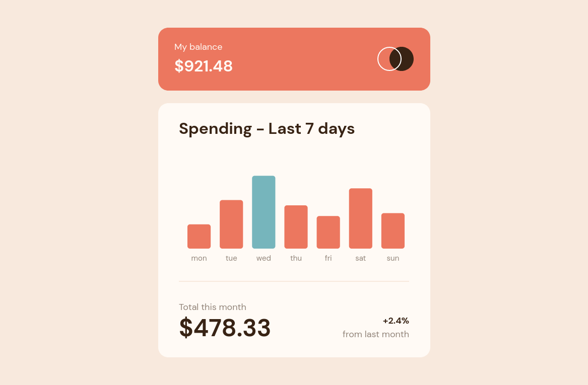

# Frontend Mentor - Expenses chart component solution

This is a solution to the [Expenses chart component challenge on Frontend Mentor](https://www.frontendmentor.io/challenges/expenses-chart-component-e7yJBUdjwt). Frontend Mentor challenges help you improve your coding skills by building realistic projects.

## Table of contents

- [The challenge](#the-challenge)
- [Links](#links)
- [Built with](#built-with)
- [Author](#author)

## The challenge

Users should be able to:

- View the bar chart and hover over the individual bars to see the correct amounts for each day
- See the current day’s bar highlighted in a different colour to the other bars
- View the optimal layout for the content depending on their device’s screen size
- See hover states for all interactive elements on the page
- **Bonus**: Use the JSON data file provided to dynamically size the bars on the chart

## Links

- [Solution URL](https://github.com/andreasremdt/fm-challenges/tree/main/expenses-chart-component/)
- [Live Site URL](https://fm-challenges-ar.netlify.app/expenses-chart-component/dist/)

## Built with

- Semantic HTML5 markup
- CSS custom properties
- Flexbox
- [Svelte](https://svelte.dev/)
- [Chart.js](https://www.chartjs.org/)
- [Vite](https://vitejs.dev/)

## Author

- Website - [andreasremdt.com](https://andreasremdt.com)
- Frontend Mentor - [@andreasremdt](https://www.frontendmentor.io/profile/andreasremdt)
