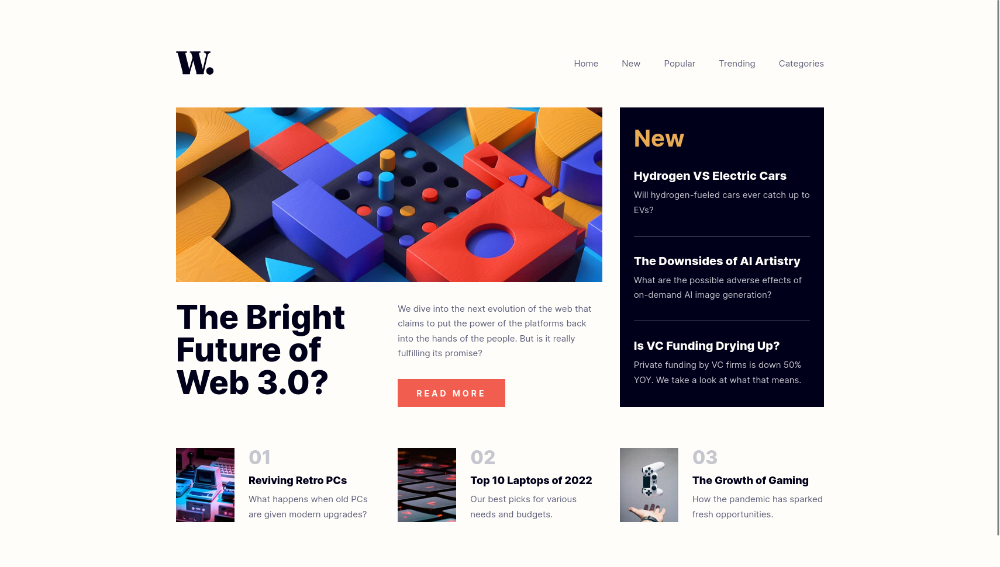

# Frontend Mentor - News homepage solution

This is a solution to the [News homepage challenge on Frontend Mentor](https://www.frontendmentor.io/challenges/news-homepage-H6SWTa1MFl). Frontend Mentor challenges help you improve your coding skills by building realistic projects.

## Table of contents

- [The challenge](#the-challenge)
- [Links](#links)
- [Built with](#built-with)
- [Author](#author)

## The challenge

Users should be able to:

- View the optimal layout depending on their device's screen size
- See hover and focus states for interactive elements

## Links

- [Solution URL](https://github.com/andreasremdt/fm-challenges/tree/main/news-homepage/)
- [Live Site URL](https://fm-challenges-ar.netlify.app/news-homepage/)

## Built with

- Semantic HTML5 markup
- JavaScript
- CSS custom properties
- CSS Grid
- Mobile-first workflow
- Variable web fonts
- HTML schemas
- Responsive images

## Author

- Website - [andreasremdt.com](https://andreasremdt.com)
- Frontend Mentor - [@andreasremdt](https://www.frontendmentor.io/profile/andreasremdt)
