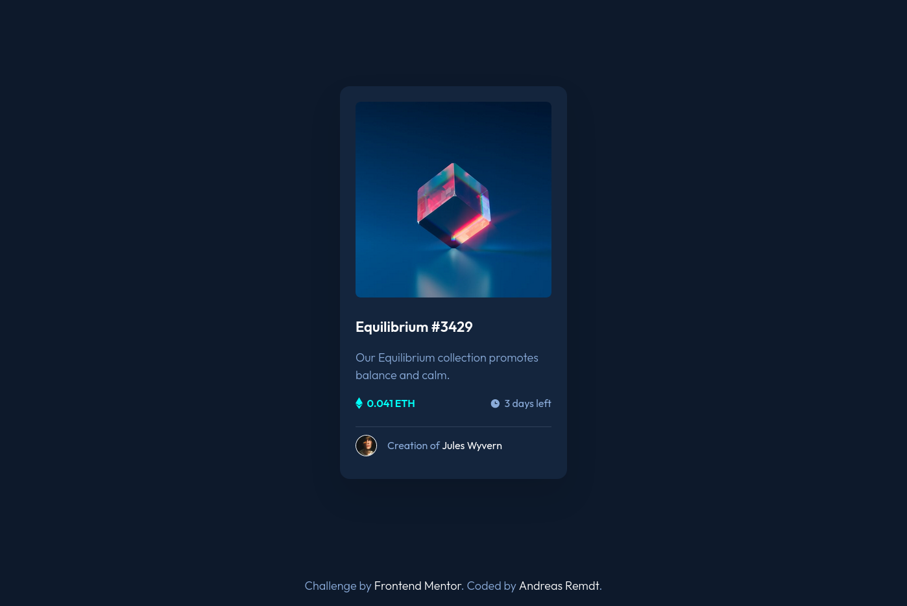

# Frontend Mentor - NFT preview card component solution

This is a solution to the [NFT preview card component challenge on Frontend Mentor](https://www.frontendmentor.io/challenges/nft-preview-card-component-SbdUL_w0U). Frontend Mentor challenges help you improve your coding skills by building realistic projects.

## Table of contents

- [Links](#links)
- [Built with](#built-with)
- [Author](#author)

### Links

- [Solution URL](https://github.com/andreasremdt/fm-challenges/tree/main/nft-preview-card-component/)
- [Live Site URL](https://fm-challenges-ar.netlify.app/nft-preview-card-component/)

### Built with

- Semantic HTML5 markup
- CSS custom properties
- CSS Grid

## Author

- Website - [andreasremdt.com](https://andreasremdt.com)
- Frontend Mentor - [@andreasremdt](https://www.frontendmentor.io/profile/andreasremdt)
