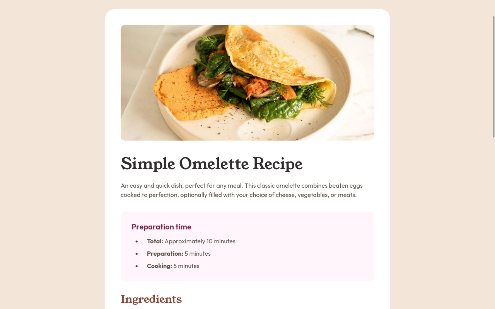

# Frontend Mentor - Recipe page solution

This is a solution to the [Recipe page challenge on Frontend Mentor](https://www.frontendmentor.io/challenges/recipe-page-KiTsR8QQKm). Frontend Mentor challenges help you improve your coding skills by building realistic projects.

## Table of contents

- [The challenge](#the-challenge)
- [Links](#links)
- [Built with](#built-with)
- [Author](#author)

## The challenge

- Build out the project to the designs provided

## Links

- [Solution URL](https://github.com/andreasremdt/fm-challenges/tree/main/recipe-page/)
- [Live Site URL](https://fm-challenges-ar.netlify.app/recipe-page/)

## Built with

- Semantic HTML5 markup
- [Schema.org](https://schema.org)
- CSS nesting
- Responsive design

## Author

- Website - [andreasremdt.com](https://andreasremdt.com)
- Frontend Mentor - [@andreasremdt](https://www.frontendmentor.io/profile/andreasremdt)
